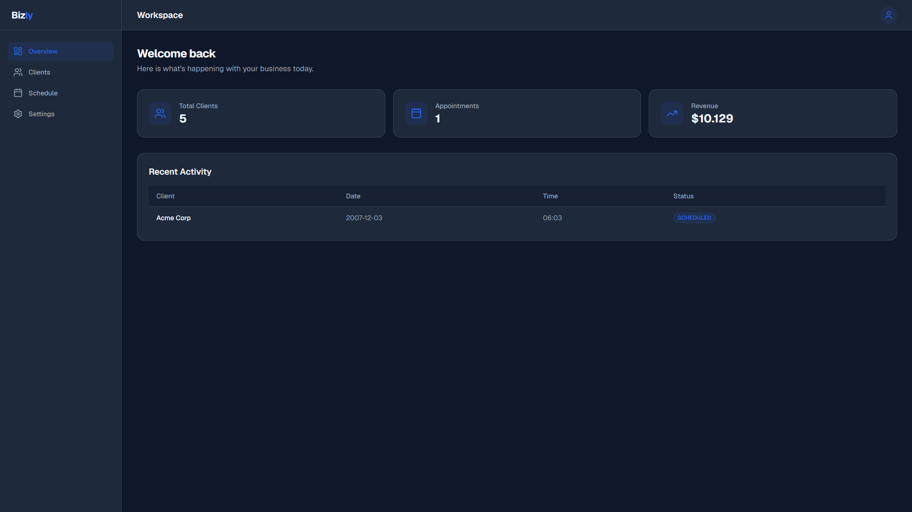
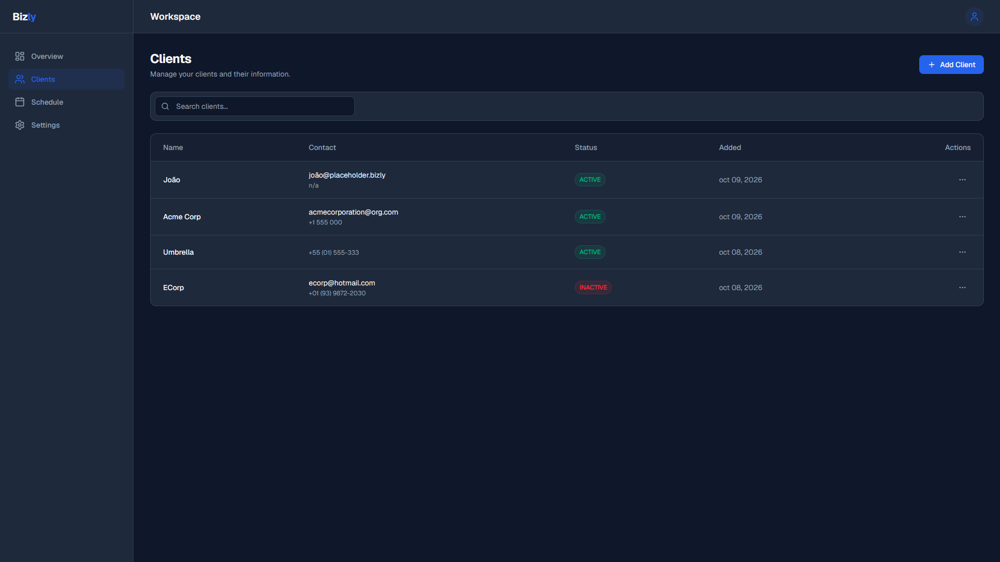
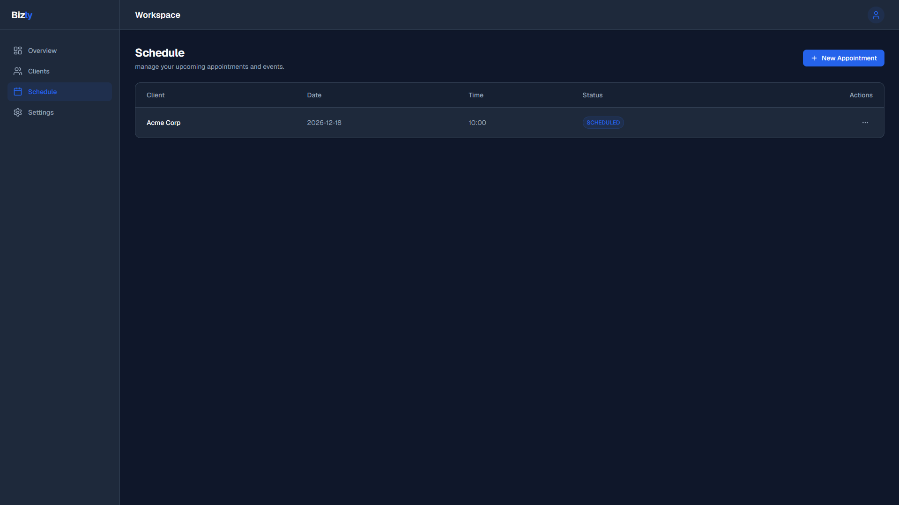

# Bizly

**Bizly** is a full-stack business management SaaS platform built for service-based businesses. It centralizes client management, appointment scheduling, and revenue tracking in a single, clean interface — giving business owners a real-time view of their operations.

---

## Screenshots







---

## Features

- **Authentication** — JWT-based register/login with "Remember Me" support and automatic token expiry handling
- **Multi-tenancy** — every resource (clients, appointments, services) is scoped to the authenticated user's company
- **Dashboard** — real-time stats: total clients, appointments and revenue pulled directly from the database
- **Client Management** — full CRUD: add, edit, search and delete clients, with unique email constraint per company
- **Appointment Scheduling** — create, edit and delete appointments with automatic client resolution and service linking
- **Protected Routes** — all API endpoints require a valid Bearer token, with guard checks at every layer

---

## Tech Stack

### Frontend

| Technology | Version | Purpose |
|---|---|---|
| [Next.js](https://nextjs.org/) | 16.3.5 | React framework with App Router and file-based routing |
| [React](https://react.dev/) | 19 | UI component model and state management |
| [TypeScript](https://www.typescriptlang.org/) | 5 | Static typing across all components and API calls |
| [Tailwind CSS](https://tailwindcss.com/) | 4 | Utility-first styling with CSS custom properties for theming |
| [Base UI](https://base-ui.com/) | 1.8 | Accessible headless components (dropdown menus, etc.) |
| [Lucide React](https://lucide.dev/) | 1.47 | Icon library |
| [Sonner](https://sonner.emilkowal.ski/) | 2 | Toast notifications |
| [js-cookie](https://github.com/js-cookie/js-cookie) | 3 | Client-side cookie management for auth token storage |
| [Geist](https://vercel.com/font) | — | Vercel's font for clean UI typography |

### Backend

| Technology | Version | Purpose |
|---|---|---|
| [FastAPI](https://fastapi.tiangolo.com/) | 0.141 | Async Python web framework with OpenAPI docs built-in |
| [Uvicorn](https://www.uvicorn.org/) | 0.53 | ASGI server to run FastAPI |
| [Prisma Client Python](https://prisma-client-py.readthedocs.io/) | 0.15 | Type-safe ORM for Python, schema-first approach |
| [SQLite](https://www.sqlite.org/) | — | Lightweight database for development (easily swappable) |
| [PyJWT](https://pyjwt.readthedocs.io/) | 2.15 | JWT generation and verification for auth |
| [Passlib + bcrypt](https://passlib.readthedocs.io/) | 1.7 / 3.2 | Secure password hashing |
| [Pydantic](https://docs.pydantic.dev/) | 2.13 | Request/response validation and data modeling |

---

## Data Models

```
Company ──< User
        ──< Customer
        ──< Service
        ──< Appointment >── Customer
                        >── Service
                        >── User
        ──< Availability
```

Each company is fully isolated. Users, clients, services and appointments all belong to a single company, ensuring data separation between tenants.

---

## Project Structure

```
Bizly/
├── bizly-frontend/          # Next.js application
│   ├── src/app/
│   │   ├── (auth)/          # Login & Register pages
│   │   ├── dashboard/       # Protected dashboard pages
│   │   │   ├── page.tsx     # Overview with live stats
│   │   │   ├── clients/     # Client management
│   │   │   └── schedule/    # Appointment scheduling
│   │   └── page.tsx         # Landing page
│   ├── src/components/      # Shared UI components
│   └── src/lib/api.ts       # Centralized fetch wrapper with auto auth header
│
└── bizly-backend/           # FastAPI application
    ├── app/
    │   ├── api/             # Route handlers
    │   │   ├── auth.py      # Register & Login
    │   │   ├── clients.py   # Client CRUD
    │   │   ├── appointments.py  # Appointment CRUD
    │   │   └── dashboard.py # Stats endpoint
    │   ├── core/
    │   │   ├── security.py  # JWT creation
    │   │   └── deps.py      # Auth dependency injection
    │   └── main.py          # App bootstrap, CORS, router registration
    └── prisma/
        └── schema.prisma    # Database schema
```

---

## Getting Started

### Backend

```bash
cd bizly-backend

# Create and activate virtual environment
python -m venv venv
.\venv\Scripts\activate       # Windows
source venv/bin/activate      # macOS/Linux

# Install dependencies
pip install fastapi uvicorn prisma passlib bcrypt pyjwt pydantic pydantic-settings

# Generate Prisma client and apply schema
prisma generate
prisma db push

# Start the server
uvicorn app.main:app --reload
```

### Frontend

```bash
cd bizly-frontend

# Install dependencies
npm install

# Create .env.local
echo "NEXT_PUBLIC_API_URL=http://127.0.0.1:8000" > .env.local

# Start the dev server
npm run dev
```

Open [http://localhost:3000](http://localhost:3000) in your browser.

---

## API Overview

All endpoints are prefixed with `/api/v1`. Protected routes require `Authorization: Bearer <token>`.

| Method | Endpoint | Description |
|---|---|---|
| `POST` | `/auth/register` | Create a new company + admin user |
| `POST` | `/auth/login` | Authenticate and receive JWT |
| `GET` | `/dashboard/stats` | Live totals: clients, appointments, revenue |
| `GET` | `/clients` | List all clients for the company |
| `POST` | `/clients` | Add a new client |
| `PUT` | `/clients/:id` | Update client details |
| `DELETE` | `/clients/:id` | Remove a client |
| `GET` | `/appointments` | List all appointments |
| `POST` | `/appointments` | Create an appointment |
| `PUT` | `/appointments/:id` | Edit an appointment |
| `DELETE` | `/appointments/:id` | Delete an appointment |
